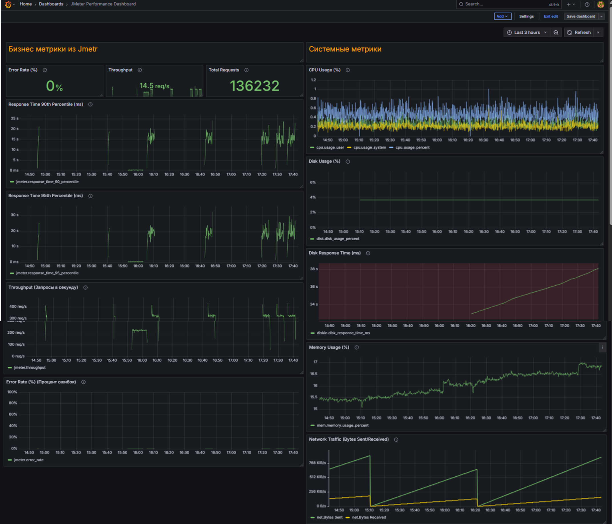

# JMeter Custom Dashboard for Load Testing Generator

## Описание

Дашборд предназначен для мониторинга нагрузочного генератора, использующего Apache JMeter для проведения тестов и Telegraf для сбора системных метрик с сервера. Он объединяет бизнес-метрики JMeter (через Backend Listener) и системные метрики (через Telegraf), чтобы получить полный обзор состояния и производительности генератора нагрузки.

---

## Скриншоты

## Что внутри дашборда

### 1. Бизнес-метрики JMeter

- **Error Rate (%)** — процент ошибок в запросах (от 0% до 100%).  
- **Throughput (Запросы в секунду)** — среднее количество запросов, выполняемых в секунду (единицы: запросы/сек).  
- **Total Requests** — общее количество выполненных запросов за выбранный период.  
- **Response Time 90th Percentile (ms)** — время отклика, не превышаемое в 90% случаев (единицы: миллисекунды).  
- **Response Time 95th Percentile (ms)** — время отклика, не превышаемое в 95% случаев (единицы: миллисекунды).  

Графики построены как временные ряды с агрегацией по интервалу времени, данные берутся из базы InfluxDB по измерениям JMeter.

### 2. Системные метрики сервера генератора (с Telegraf)

- **CPU Usage (%)** — средняя загрузка процессора (сумма времени, занятого пользовательскими и системными процессами).  
- **Memory Usage (%)** — процент использования оперативной памяти.  
- **Disk Usage (%)** — процент использования дискового пространства.  
- **Disk Response Time (ms)** — время отклика дисковой подсистемы (рекомендуемый максимум — 15 мс).  
- **Network Traffic (Bytes Sent/Received)** — объем сетевого трафика, отправленного и полученного сервером (единицы: байты в секунду).  

---

## Thresholds (Пороги тревог)

- CPU: 80% — рекомендуемый максимум.  
- Disk Usage: 90% — высокий уровень использования диска.  
- Disk Response Time: 15 мс — рекомендуемый максимальный порог времени отклика.  

Thresholds отображаются цветными линиями или областями на графиках для оперативного выявления проблем.

---

## Технические детали

- Источник данных: InfluxDB (метрики JMeter и системные метрики Telegraf).  
- Визуализация: Grafana (панели Time Series и Stat).  
- Запросы: InfluxQL с использованием агрегации `mean()` и группировкой по времени `GROUP BY time($__interval)`.  
- Интервалы обновления: обычно 5-10 секунд.

---

## Как использовать

1. Запустите Telegraf с конфигурацией для сбора системных метрик.  
2. Настройте JMeter Backend Listener для отправки бизнес-метрик в InfluxDB.  
3. Импортируйте дашборд в Grafana.  
4. Настройте нужные временные интервалы и отслеживайте показатели.

